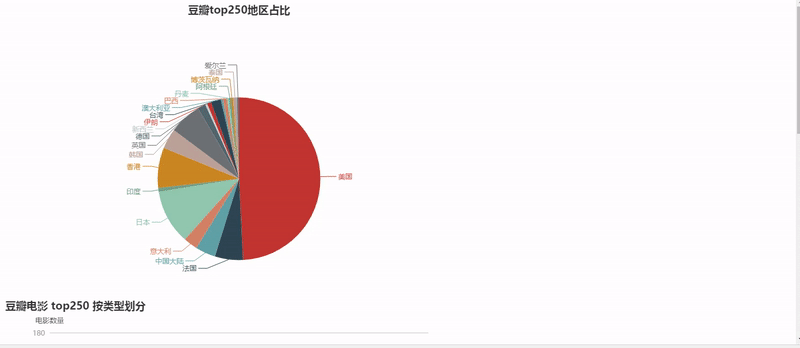
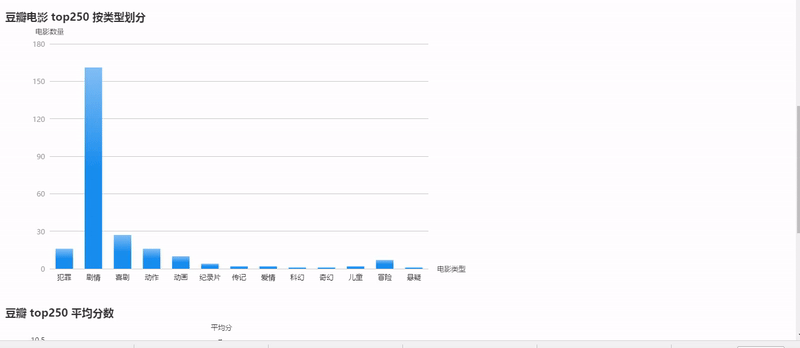
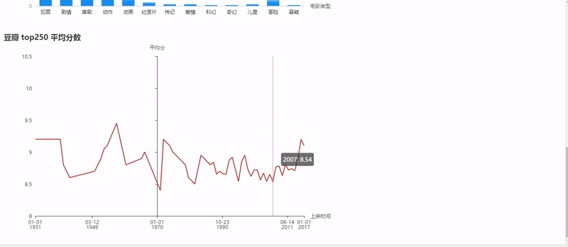

# 豆瓣电影 Top250 爬虫 数据可视化

**注意:**

在根目录下执行 npm install 或者 yarn install（如果有装yarn的话）安装依赖

在 data//movie.json 里面是用 Node.js 爬虫爬取到的电影数据

再执行 node app.js 启动程序

然后在浏览器输入 localhost:8000 就可以看到页面了

### 下面是实际的演示:  

### 动态

=======
